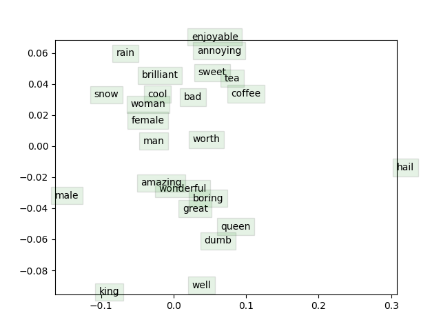

# Assignment 2
* [Assignment2 (Winter 2024)].
* For detailed executions, see [assignment2 (Winter 2024).ipynb].

## Note
This assignment is not included in the Spring 2024 class, but I still do it for practice. ：）

## Result
```
iter 40000: 9.812206
sanity check: cost at convergence should be around or below 10
training took 6131 seconds
```


We can see the classic instance: male → king ≒ female → queen. We can also see some clusters of words of similar meanings or contexts, like ['brilliant', 'sweet', 'cool', 'bad'] or ['amazing',  'wonderful', 'boring', 'great']. One unusual observation is that 'hail' is far away from 'rain' or 'snow' (although they could have similar contexts), possibly due to 'hail' having other meanings, such as 'to acclaim' or 'to call out'.


[Assignment2 (Winter 2024)]: https://web.stanford.edu/class/archive/cs/cs224n/cs224n.1244/assignments/a2.pdf
[assignment2 (Winter 2024).ipynb]: <assignment2 (Winter 2024).ipynb>
